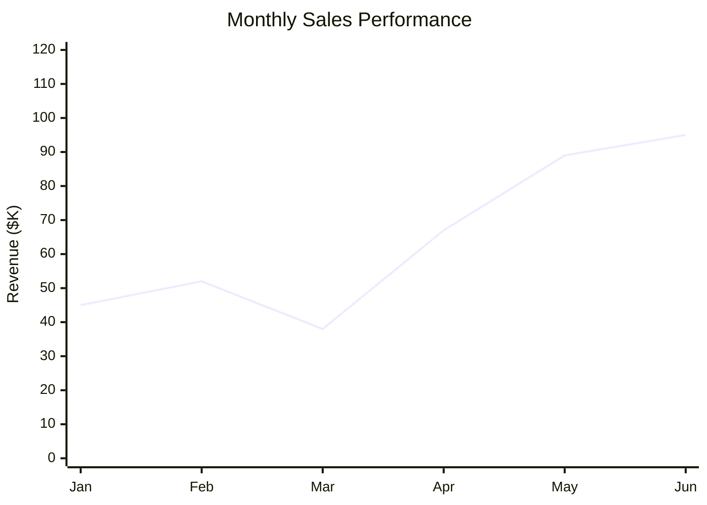
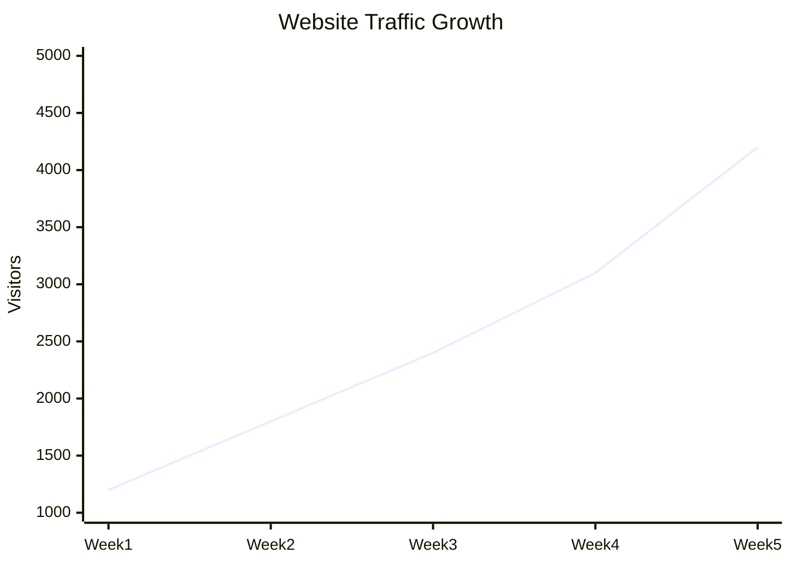
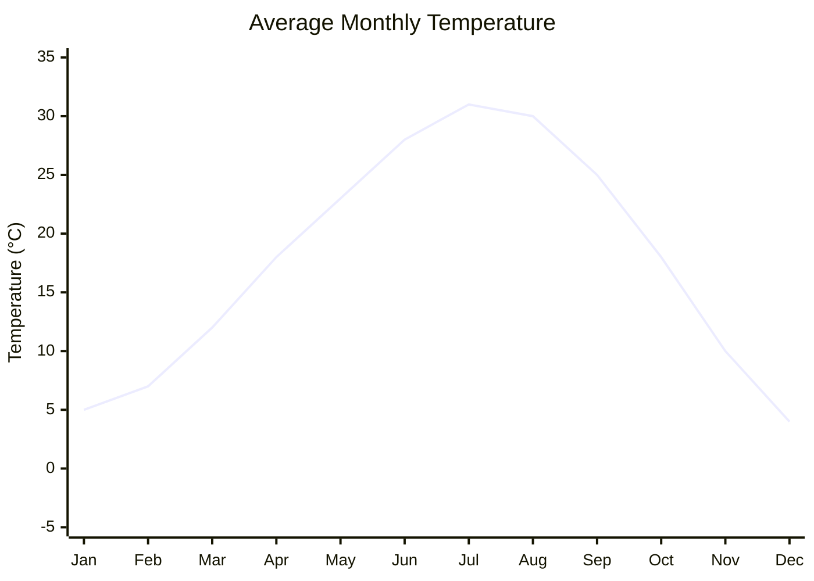

# Swimlane Converter

A command-line tool that converts Mermaid xychart-beta line charts into Draw.io compatible XML format. Perfect for creating professional-looking line charts that can be imported into Draw.io for further editing and styling.

## Features

- ✅ Converts Mermaid xychart-beta syntax to Draw.io XML
- ✅ Automatic geometry calculation and scaling
- ✅ Professional styling with axes, grid lines, and labels
- ✅ Data points with values displayed
- ✅ Customizable chart titles and axis labels
- ✅ Support for various data ranges and scales

## Installation

1. Clone or download this repository
2. Install dependencies:
   ```bash
   npm install
   ```

## Usage

```bash
node converter.js <input_file.mmd> <output_file.xml>
```

### Example

```bash
node converter.js sample_chart.mmd sample_chart.xml
```

## Mermaid Syntax Format

Create your charts using the following xychart-beta syntax:

```mermaid
xychart-beta
    title "Your Chart Title"
    x-axis [Label1, Label2, Label3, ...]
    y-axis "Y-Axis Label" min_value --> max_value
    line [value1, value2, value3, ...]
```

### Parameters

- **title**: Chart title (optional, defaults to "Untitled Chart")
- **x-axis**: Array of X-axis labels in square brackets
- **y-axis**: Y-axis label followed by min and max values separated by `-->`
- **line**: Array of numeric data points in square brackets

## Examples

### Sales Performance Chart


### Website Traffic Growth


### Temperature Data


## Output

The converter generates Draw.io XML files that include:
- Properly scaled coordinate system
- X and Y axes with arrowheads
- Axis labels and tick marks
- Grid lines for reference
- Connected data points with blue lines
- Red circular data points with white background labels
- Chart title at the top

## Opening in Draw.io

1. Go to [https://app.diagrams.net/](https://app.diagrams.net/)
2. Choose "Open Existing Diagram" → "open from device"
3. Select your generated `.xml` file
4. The chart will load with full editing capabilities

## Sample Charts Included

The repository includes several sample charts:
- `sample_chart.mmd/xml` - Monthly sales performance
- `traffic_chart.mmd/xml` - Website traffic growth
- `inventory_chart.mmd/xml` - Product inventory levels
- `temperature_chart.mmd/xml` - Seasonal temperature data
- `stock_chart.mmd/xml` - Stock price fluctuations
- `progress_chart.mmd/xml` - Project completion progress
- `downloads_chart.mmd/xml` - App download growth

## Technical Details

- **Canvas Size**: 600x400 pixels with 60px padding
- **Line Color**: Blue (#0066CC)
- **Data Points**: Red circles with white background labels
- **Grid Lines**: Light gray dashed lines
- **Font**: Default Draw.io fonts with size 11 for data points, 18 for titles

## Dependencies

- `commander`: ^14.0.2 - CLI argument parsing
- `xmlbuilder2`: ^4.0.3 - XML generation

## License

ISC License

## Contributing

Feel free to submit issues and enhancement requests!</content>
<parameter name="filePath">/Users/disandup/Desktop/Swimlane Converter/README.md
